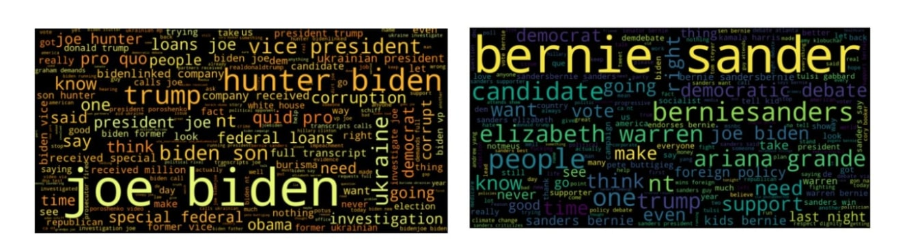
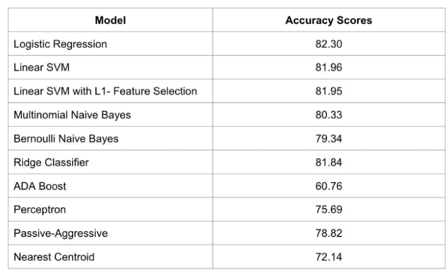

Scraped tweets from Twitter's API in order to perform analysis such as determining whether a tweet was from a democratic or republican source. Additionally I was able to look at the different democratic political candidates and determine whethher or not they had a positive presense on Twitter. Tweets were scraped based on if they contained reference to any of the democratic nominees for the 2020 election after each national debate.

These are some of the most common words found during our analysis displayed in a word cloud format

Used SVM, SGD and NB classifiers along with Neural Nets to create models for opinion based on a Tf-idf vectorizer. This was done using python and sklearn. Achieved over 80% accuracy in predciting whether a tweet was democratic or republican.

Here are some of the models and their corresponding accuracies.

