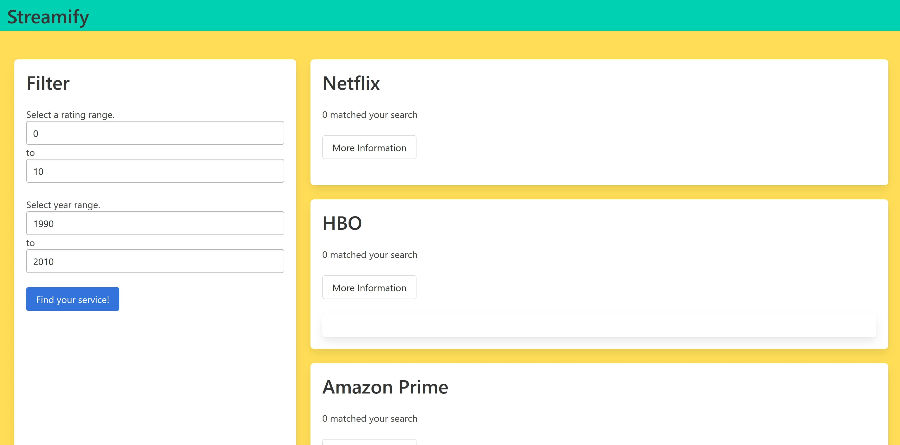

Web application that retrieves movies from an API and presents them according to streaming service. 

Link to the website: https://ethanwu18.github.io/rvcasecomp/

We have an interactive filtering system with year of release and movie rating from which you can choose from.
This is built using jQuery and uses an API to retrieve the information.

